# DLthon 프로젝트 5팀 [조아요]

# 프로젝트 설명
2021 인공지능 그랜드 챌린지 대회를 위한 TUNiB에서 자체적으로 제작한 데이터 셋을  활용하여 "대화의 셩격을 위협 세부 클래스 4개 또는 일반 대화 중 하나로 예측하는 과제"를 진행

# 데이터 설명
* 학습 데이터는 '협박', '갈취', '직장 내 괴롭힘', '기타 괴롭힘' 등 4개 클래스 각 약 1천 개로 구성
* 테스트 데이터는 '협박', '갈취', '직장 내 괴롭힘', '기타 괴롭힘', '일반 대화' 등 5개 클래스 각 1백여 개로 구성. Index와 Conversation만 제공

# 평가 지표
모델이 분류한 결과와 정답 간의 f1 score로 측정
$F1 Score = 2 * {recall * precision} \over {recall + precision}$

# 파일 설명
* EDA_DAta.ipynb [EDA 설명](#eda) [전처리 설명](#데이터-전처리)
* Project.ipynb [모델 선택 설명](#모델-선택)
* Train.ipynb [모델 학습 설명](#모델-학습-튜닝)

# EDA
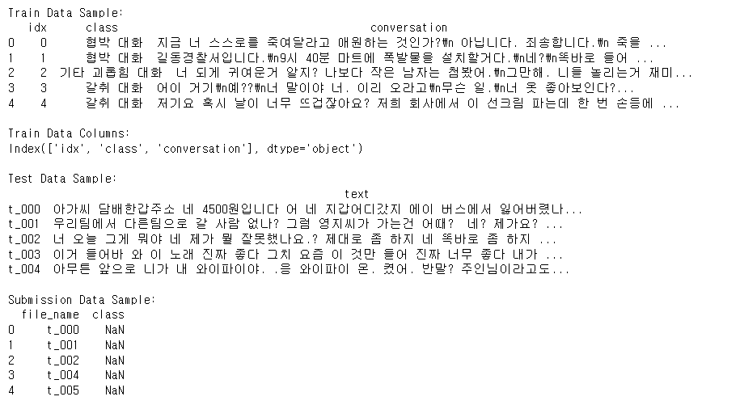
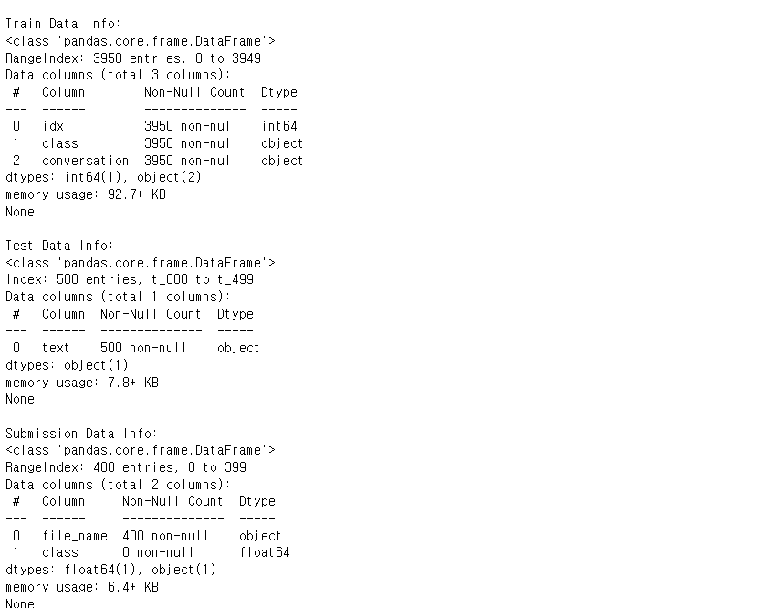

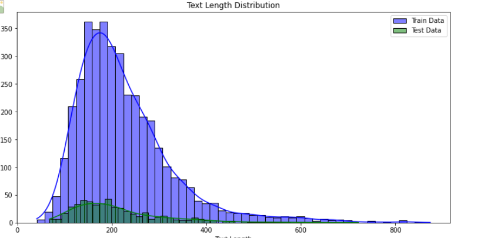

### 데이터별 워드클라우드
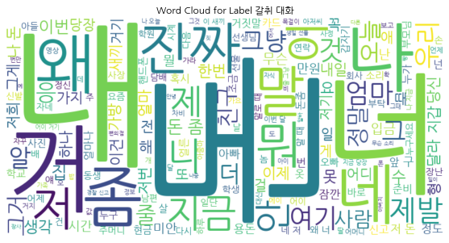
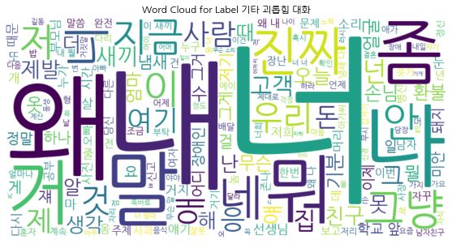
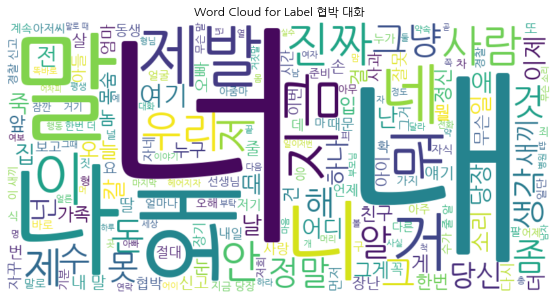
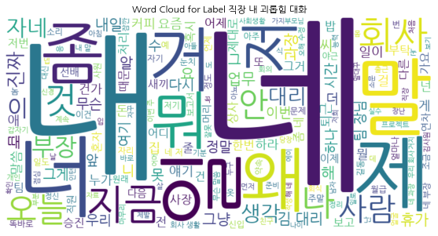
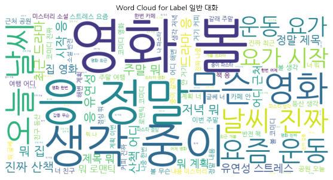

### 클래스 분포
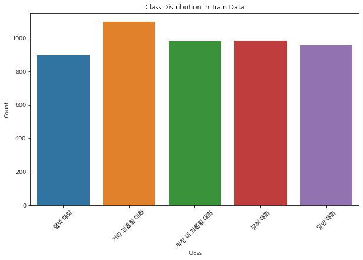

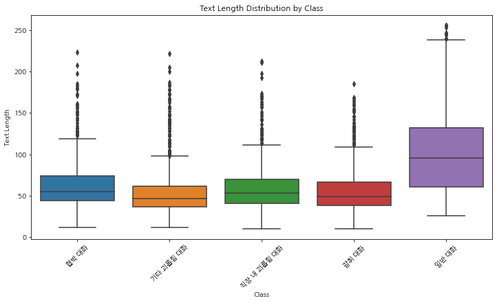

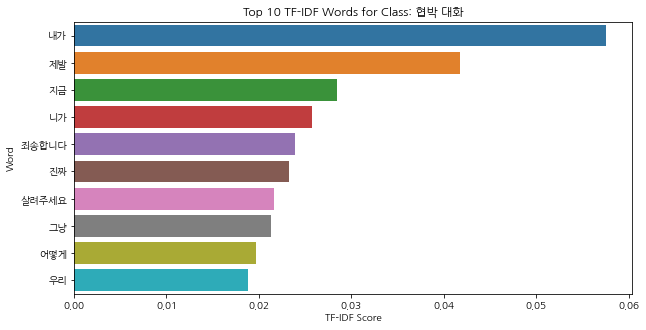
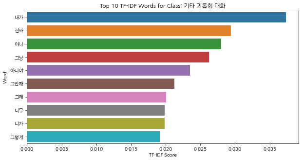
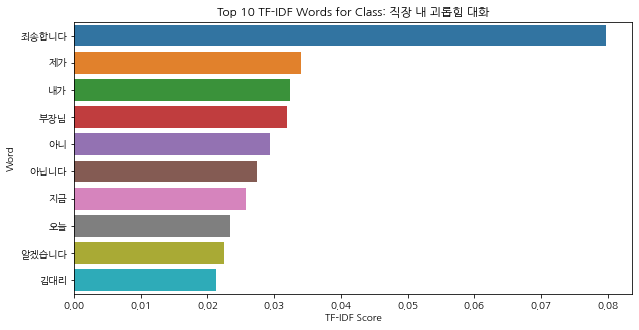
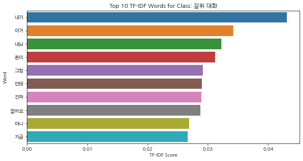
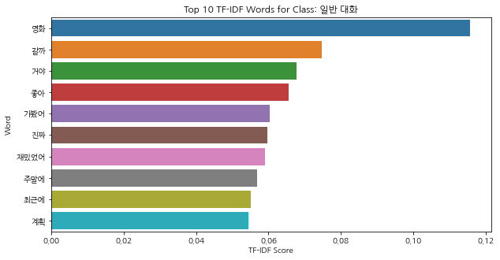

# 데이터 전처리

# 모델 선택

# 모델 학습 [튜닝]

# 결과 분석

# 리더 보드

# 실험 Log